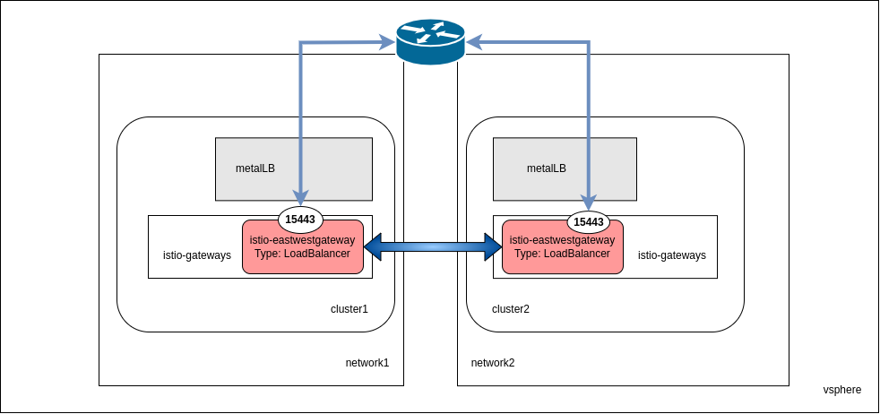

# Istio multicluster & multiprimary with Sail Operator - OpenShift

Installing Istio with Sail Operator on OpenShift (vSphere).

The same cluster domain is used in both clusters.

## Prerequisites
- The same root of trust must be used in this use case. For this, follow the Istio [guide](https://istio.io/latest/docs/tasks/security/cert-management/plugin-ca-cert/).
- MetalLB installed.

## Top-level architecture



## Sail Operator

Follow the [README](https://github.com/maistra/istio-operator/blob/maistra-3.0/bundle/README.md) doc.

## Installing Istio

Create OCP project:
```bash
oc new-project istio-system
oc new-project istio-gateways
```

- Cluster1
```bash
oc label namespace istio-system topology.istio.io/network=cluster1-network
```

- Cluster2
```bash
oc label namespace istio-system topology.istio.io/network=cluster2-network
```

Create CA and certificates.Open a new terminal, clone the Istio [repository](https://github.com/istio/istio) and go to _istio_ folder (new cloned repo). The steps must be executed from _istio_ folder.
```bash
mkdir certs
pushd certs
make -f ../tools/certs/Makefile.selfsigned.mk root-ca
make -f ../tools/certs/Makefile.selfsigned.mk cluster1-cacerts
make -f ../tools/certs/Makefile.selfsigned.mk cluster2-cacerts
```

Create the Istio secret in both clusters:

- Cluster1
```bash
oc create secret generic cacerts -n istio-system \
      --from-file=cluster1/ca-cert.pem \
      --from-file=cluster1/ca-key.pem \
      --from-file=cluster1/root-cert.pem \
      --from-file=cluster1/cert-chain.pem
```

- Cluster2
```bash
oc create secret generic cacerts -n istio-system \
      --from-file=cluster2/ca-cert.pem \
      --from-file=cluster2/ca-key.pem \
      --from-file=cluster2/root-cert.pem \
      --from-file=cluster2/cert-chain.pem
```

```bash
popd
```


Install Istio by executing:

- Cluster1
```bash
oc -n istio-system apply -f scenario-1/0-istio-setup/istio-cluster1.yaml
```

- Cluster2
```bash
oc -n istio-system apply -f scenario-1/0-istio-setup/istio-cluster2.yaml
```

## Deploy East-West gateways in both clusters

- Cluster1:
```bash
helm install istio-eastwestgateway istio/gateway --set networkGateway=cluster1-network -n istio-gateways  -f scenario-1/1-multicluster/openshift-values.yaml
```

- Cluster2:
```bash
helm install istio-eastwestgateway istio/gateway --set networkGateway=cluster2-network -n istio-gateways  -f scenario-1/1-multicluster/openshift-values.yaml
```

### Configure multicluster-multiprimary

Both clusters:
```bash
oc apply -f scenario-1/1-multicluster/gw.yaml
```

- Cluster1:
```bash
istioctl x create-remote-secret --name=cluster1 > scenario-1/1-multicluster/remote-secret-cluster2.yaml
```

- Cluster2:
```bash
istioctl x create-remote-secret --name=cluster2 > scenario-1/1-multicluster/remote-secret-cluster1.yaml
```

- Cluster1:
```bash
oc apply -f scenario-1/1-multicluster/remote-secret-cluster1.yaml
```

- Cluster2:
```bash
oc apply -f scenario-1/1-multicluster/remote-secret-cluster2.yaml
```

## Deploying the helloworld sample application

Create the _my-awesome-project_ OCP project:
```bash
oc new-project my-awesome-project
```

Since we are using [Automatic Sidecar Injection](https://istio.io/latest/docs/setup/additional-setup/sidecar-injection/#automatic-sidecar-injection), label the _my-awesome-project_ OCP project:

```bash
oc label namespace my-awesome-project istio-injection=enabled
```

Deploy the _helloworld_ application:
```bash
oc apply -f https://raw.githubusercontent.com/istio/istio/master/samples/helloworld/helloworld.yaml -l version=v1 -n my-awesome-project
oc apply -f https://raw.githubusercontent.com/istio/istio/master/samples/helloworld/helloworld.yaml -l service=helloworld -n my-awesome-project
```

Deploy the _sleep_ application:
```bash
oc apply -f common/2-data-plane/sleep-app/deploy.yaml
```

## Cleanup
Run in both clusters:
```bash
oc delete project my-awesome-project
helm uninstall istio-eastwestgateway -n istio-gateways
oc delete istio multicluster -n istio-system
oc delete project istio-gateways
oc delete project istio-system
```

## Author

Fran Perea Rodríguez @RedHat